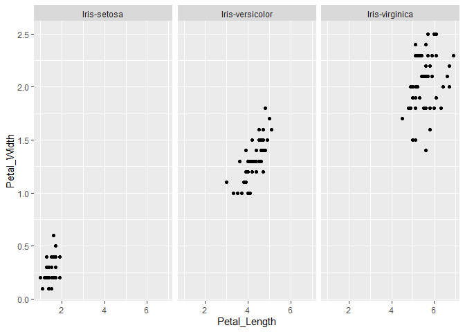
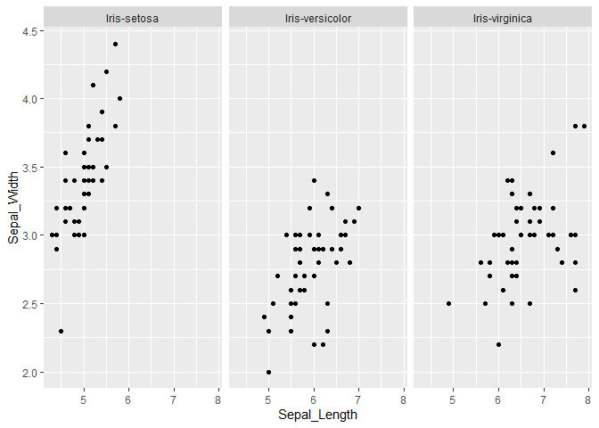
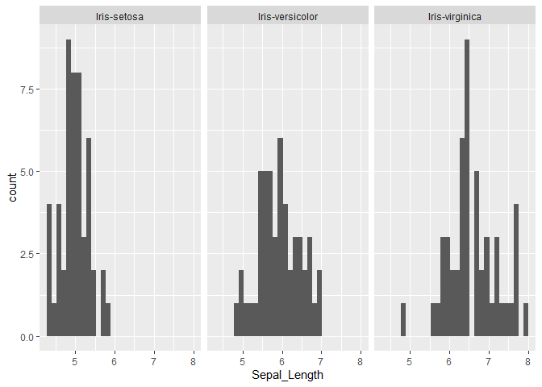
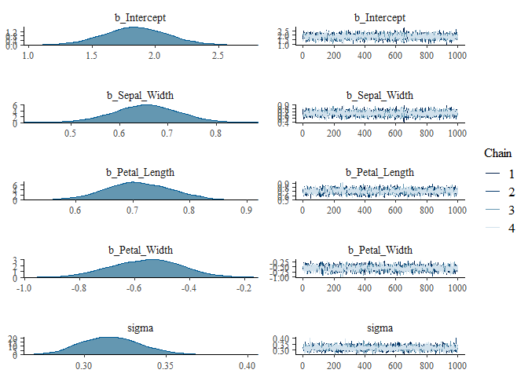

```r
library(tidyverse)
```

```
## -- Attaching packages -------------------------------------------------------------------- tidyverse 1.2.1 --
```

```
## v ggplot2 3.2.1     v purrr   0.3.2
## v tibble  2.1.3     v dplyr   0.8.3
## v tidyr   1.0.0     v stringr 1.4.0
## v readr   1.3.1     v forcats 0.4.0
```

```
## -- Conflicts ----------------------------------------------------------------------- tidyverse_conflicts() --
## x dplyr::filter() masks stats::filter()
## x dplyr::lag()    masks stats::lag()
```

```r
library(ggplot2)
library(brms)
```

```
## Loading required package: Rcpp
```

```
## Registered S3 method overwritten by 'xts':
##   method     from
##   as.zoo.xts zoo
```

```
## Loading 'brms' package (version 2.10.0). Useful instructions
## can be found by typing help('brms'). A more detailed introduction
## to the package is available through vignette('brms_overview').
```

#Data

```r
iris <-read_csv('iris.data', col_names = FALSE)
```

```
## Parsed with column specification:
## cols(
##   X1 = col_double(),
##   X2 = col_double(),
##   X3 = col_double(),
##   X4 = col_double(),
##   X5 = col_character()
## )
```

```r
head(iris)
```

```
## # A tibble: 6 x 5
##      X1    X2    X3    X4 X5         
##   <dbl> <dbl> <dbl> <dbl> <chr>      
## 1   5.1   3.5   1.4   0.2 Iris-setosa
## 2   4.9   3     1.4   0.2 Iris-setosa
## 3   4.7   3.2   1.3   0.2 Iris-setosa
## 4   4.6   3.1   1.5   0.2 Iris-setosa
## 5   5     3.6   1.4   0.2 Iris-setosa
## 6   5.4   3.9   1.7   0.4 Iris-setosa
```
#Add header

```r
cols = c('Sepal_Length', 'Sepal_Width', 'Petal_Length', 'Petal_Width', 'Class')
names(iris) = cols

head(iris)
```

```
## # A tibble: 6 x 5
##   Sepal_Length Sepal_Width Petal_Length Petal_Width Class      
##          <dbl>       <dbl>        <dbl>       <dbl> <chr>      
## 1          5.1         3.5          1.4         0.2 Iris-setosa
## 2          4.9         3            1.4         0.2 Iris-setosa
## 3          4.7         3.2          1.3         0.2 Iris-setosa
## 4          4.6         3.1          1.5         0.2 Iris-setosa
## 5          5           3.6          1.4         0.2 Iris-setosa
## 6          5.4         3.9          1.7         0.4 Iris-setosa
```


#Data visualisation

```r
graph1 = iris%>%
  ggplot(aes(x=Petal_Length, y= Petal_Width)) + 
  geom_point()+ facet_wrap('Class')
graph1
```

<!-- -->

```r
iris%>%
  ggplot(aes(x=Sepal_Length, y= Sepal_Width)) + 
  geom_point()+ facet_wrap('Class')
```

<!-- -->

```r
iris%>%
  ggplot(aes(Sepal_Length)) + 
  geom_histogram()+ facet_wrap('Class')
```

```
## `stat_bin()` using `bins = 30`. Pick better value with `binwidth`.
```

<!-- -->

```r
#Missing values
length(which(!complete.cases(iris)))
```

```
## [1] 0
```

```r
iris= within(iris, {
    Class= factor(Class)
})
head(iris)
```

```
## # A tibble: 6 x 5
##   Sepal_Length Sepal_Width Petal_Length Petal_Width Class      
##          <dbl>       <dbl>        <dbl>       <dbl> <fct>      
## 1          5.1         3.5          1.4         0.2 Iris-setosa
## 2          4.9         3            1.4         0.2 Iris-setosa
## 3          4.7         3.2          1.3         0.2 Iris-setosa
## 4          4.6         3.1          1.5         0.2 Iris-setosa
## 5          5           3.6          1.4         0.2 Iris-setosa
## 6          5.4         3.9          1.7         0.4 Iris-setosa
```

#Can we predict Sepal_length from over variable?
#get_prior
  family = 'gaussian'

```r
get_prior(formula = Sepal_Length ~ Sepal_Width + Petal_Length + Petal_Width,  data = iris)
```

```
##                 prior     class         coef group resp dpar nlpar bound
## 1                             b                                         
## 2                             b Petal_Length                            
## 3                             b  Petal_Width                            
## 4                             b  Sepal_Width                            
## 5 student_t(3, 6, 10) Intercept                                         
## 6 student_t(3, 0, 10)     sigma
```

```r
#Since Class is not numeric can't make a model whitout converting it in to num.
get_prior(formula = Class ~ Sepal_Length + Sepal_Width + Petal_Length + Petal_Width,  data = iris, family = 'poisson')
```

```
##                 prior     class         coef group resp dpar nlpar bound
## 1                             b                                         
## 2                             b Petal_Length                            
## 3                             b  Petal_Width                            
## 4                             b Sepal_Length                            
## 5                             b  Sepal_Width                            
## 6 student_t(3, 0, 10) Intercept
```

#Set_prior

```r
prior = c(
  prior(student_t(3, 0, 10), class = Intercept),
  prior(normal(5,10), class = b),
  prior(student_t(3, 0, 10), class = sigma)
)
prior2 = c(
  prior(student_t(3, 0, 10), class = Intercept),
  prior(normal(5,10), class = b)
)
```

#brm

```r
Sepal_Length_brm2 = brm(formula = Sepal_Length ~ Sepal_Width + Petal_Length + Petal_Width,  data = iris, prior = prior2)
```

```
## Compiling the C++ model
```

```
## Start sampling
```

```
## 
## SAMPLING FOR MODEL '7c19941c467e38f23244ff2d8ee39ec8' NOW (CHAIN 1).
## Chain 1: 
## Chain 1: Gradient evaluation took 0 seconds
## Chain 1: 1000 transitions using 10 leapfrog steps per transition would take 0 seconds.
## Chain 1: Adjust your expectations accordingly!
## Chain 1: 
## Chain 1: 
## Chain 1: Iteration:    1 / 2000 [  0%]  (Warmup)
## Chain 1: Iteration:  200 / 2000 [ 10%]  (Warmup)
## Chain 1: Iteration:  400 / 2000 [ 20%]  (Warmup)
## Chain 1: Iteration:  600 / 2000 [ 30%]  (Warmup)
## Chain 1: Iteration:  800 / 2000 [ 40%]  (Warmup)
## Chain 1: Iteration: 1000 / 2000 [ 50%]  (Warmup)
## Chain 1: Iteration: 1001 / 2000 [ 50%]  (Sampling)
## Chain 1: Iteration: 1200 / 2000 [ 60%]  (Sampling)
## Chain 1: Iteration: 1400 / 2000 [ 70%]  (Sampling)
## Chain 1: Iteration: 1600 / 2000 [ 80%]  (Sampling)
## Chain 1: Iteration: 1800 / 2000 [ 90%]  (Sampling)
## Chain 1: Iteration: 2000 / 2000 [100%]  (Sampling)
## Chain 1: 
## Chain 1:  Elapsed Time: 0.352 seconds (Warm-up)
## Chain 1:                0.364 seconds (Sampling)
## Chain 1:                0.716 seconds (Total)
## Chain 1: 
## 
## SAMPLING FOR MODEL '7c19941c467e38f23244ff2d8ee39ec8' NOW (CHAIN 2).
## Chain 2: 
## Chain 2: Gradient evaluation took 0 seconds
## Chain 2: 1000 transitions using 10 leapfrog steps per transition would take 0 seconds.
## Chain 2: Adjust your expectations accordingly!
## Chain 2: 
## Chain 2: 
## Chain 2: Iteration:    1 / 2000 [  0%]  (Warmup)
## Chain 2: Iteration:  200 / 2000 [ 10%]  (Warmup)
## Chain 2: Iteration:  400 / 2000 [ 20%]  (Warmup)
## Chain 2: Iteration:  600 / 2000 [ 30%]  (Warmup)
## Chain 2: Iteration:  800 / 2000 [ 40%]  (Warmup)
## Chain 2: Iteration: 1000 / 2000 [ 50%]  (Warmup)
## Chain 2: Iteration: 1001 / 2000 [ 50%]  (Sampling)
## Chain 2: Iteration: 1200 / 2000 [ 60%]  (Sampling)
## Chain 2: Iteration: 1400 / 2000 [ 70%]  (Sampling)
## Chain 2: Iteration: 1600 / 2000 [ 80%]  (Sampling)
## Chain 2: Iteration: 1800 / 2000 [ 90%]  (Sampling)
## Chain 2: Iteration: 2000 / 2000 [100%]  (Sampling)
## Chain 2: 
## Chain 2:  Elapsed Time: 0.352 seconds (Warm-up)
## Chain 2:                0.381 seconds (Sampling)
## Chain 2:                0.733 seconds (Total)
## Chain 2: 
## 
## SAMPLING FOR MODEL '7c19941c467e38f23244ff2d8ee39ec8' NOW (CHAIN 3).
## Chain 3: 
## Chain 3: Gradient evaluation took 0 seconds
## Chain 3: 1000 transitions using 10 leapfrog steps per transition would take 0 seconds.
## Chain 3: Adjust your expectations accordingly!
## Chain 3: 
## Chain 3: 
## Chain 3: Iteration:    1 / 2000 [  0%]  (Warmup)
## Chain 3: Iteration:  200 / 2000 [ 10%]  (Warmup)
## Chain 3: Iteration:  400 / 2000 [ 20%]  (Warmup)
## Chain 3: Iteration:  600 / 2000 [ 30%]  (Warmup)
## Chain 3: Iteration:  800 / 2000 [ 40%]  (Warmup)
## Chain 3: Iteration: 1000 / 2000 [ 50%]  (Warmup)
## Chain 3: Iteration: 1001 / 2000 [ 50%]  (Sampling)
## Chain 3: Iteration: 1200 / 2000 [ 60%]  (Sampling)
## Chain 3: Iteration: 1400 / 2000 [ 70%]  (Sampling)
## Chain 3: Iteration: 1600 / 2000 [ 80%]  (Sampling)
## Chain 3: Iteration: 1800 / 2000 [ 90%]  (Sampling)
## Chain 3: Iteration: 2000 / 2000 [100%]  (Sampling)
## Chain 3: 
## Chain 3:  Elapsed Time: 0.379 seconds (Warm-up)
## Chain 3:                0.358 seconds (Sampling)
## Chain 3:                0.737 seconds (Total)
## Chain 3: 
## 
## SAMPLING FOR MODEL '7c19941c467e38f23244ff2d8ee39ec8' NOW (CHAIN 4).
## Chain 4: 
## Chain 4: Gradient evaluation took 0 seconds
## Chain 4: 1000 transitions using 10 leapfrog steps per transition would take 0 seconds.
## Chain 4: Adjust your expectations accordingly!
## Chain 4: 
## Chain 4: 
## Chain 4: Iteration:    1 / 2000 [  0%]  (Warmup)
## Chain 4: Iteration:  200 / 2000 [ 10%]  (Warmup)
## Chain 4: Iteration:  400 / 2000 [ 20%]  (Warmup)
## Chain 4: Iteration:  600 / 2000 [ 30%]  (Warmup)
## Chain 4: Iteration:  800 / 2000 [ 40%]  (Warmup)
## Chain 4: Iteration: 1000 / 2000 [ 50%]  (Warmup)
## Chain 4: Iteration: 1001 / 2000 [ 50%]  (Sampling)
## Chain 4: Iteration: 1200 / 2000 [ 60%]  (Sampling)
## Chain 4: Iteration: 1400 / 2000 [ 70%]  (Sampling)
## Chain 4: Iteration: 1600 / 2000 [ 80%]  (Sampling)
## Chain 4: Iteration: 1800 / 2000 [ 90%]  (Sampling)
## Chain 4: Iteration: 2000 / 2000 [100%]  (Sampling)
## Chain 4: 
## Chain 4:  Elapsed Time: 0.323 seconds (Warm-up)
## Chain 4:                0.405 seconds (Sampling)
## Chain 4:                0.728 seconds (Total)
## Chain 4:
```

```r
summary(Sepal_Length_brm2)
```

```
##  Family: gaussian 
##   Links: mu = identity; sigma = identity 
## Formula: Sepal_Length ~ Sepal_Width + Petal_Length + Petal_Width 
##    Data: iris (Number of observations: 150) 
## Samples: 4 chains, each with iter = 2000; warmup = 1000; thin = 1;
##          total post-warmup samples = 4000
## 
## Population-Level Effects: 
##              Estimate Est.Error l-95% CI u-95% CI Rhat Bulk_ESS Tail_ESS
## Intercept        1.84      0.25     1.34     2.34 1.00     2336     2496
## Sepal_Width      0.66      0.07     0.52     0.79 1.00     2629     2351
## Petal_Length     0.71      0.06     0.60     0.82 1.00     1833     2344
## Petal_Width     -0.56      0.13    -0.81    -0.31 1.00     1911     2309
## 
## Family Specific Parameters: 
##       Estimate Est.Error l-95% CI u-95% CI Rhat Bulk_ESS Tail_ESS
## sigma     0.32      0.02     0.28     0.35 1.00     2951     2585
## 
## Samples were drawn using sampling(NUTS). For each parameter, Eff.Sample 
## is a crude measure of effective sample size, and Rhat is the potential 
## scale reduction factor on split chains (at convergence, Rhat = 1).
```

```r
plot(Sepal_Length_brm2)
```

<!-- -->


```r
to_pred = tibble(Sepal_Width = 3.5, Petal_Length= 1.4, Petal_Width= 0.2)
pred = predict(Sepal_Length_brm2, newdata = to_pred )
pred
```

```
##      Estimate Est.Error     Q2.5    Q97.5
## [1,] 5.014613 0.3084007 4.410495 5.636568
```

#Poissson

```r
get_prior(formula = Sepal_Length ~ Sepal_Width + Petal_Length + Petal_Width,  data = iris, family = 'poisson')
```

```
##                 prior     class         coef group resp dpar nlpar bound
## 1                             b                                         
## 2                             b Petal_Length                            
## 3                             b  Petal_Width                            
## 4                             b  Sepal_Width                            
## 5 student_t(3, 2, 10) Intercept
```


```r
prior3 = c(
  prior(student_t(3, 2, 10), class = Intercept),
  prior(normal(5,10), class = b)
)
```

#Round value.

```r
iris= within(iris, {
    Sepal_Length= round(Sepal_Length)
})
Sepal_Length_brm3 = brm(formula = Sepal_Length ~ Sepal_Width + Petal_Length + Petal_Width,  data = iris, prior = prior3, family ='poisson' )
```

```
## Compiling the C++ model
```

```
## Start sampling
```

```
## 
## SAMPLING FOR MODEL '68e0b1707824f79e9c7b17bc33501910' NOW (CHAIN 1).
## Chain 1: 
## Chain 1: Gradient evaluation took 0 seconds
## Chain 1: 1000 transitions using 10 leapfrog steps per transition would take 0 seconds.
## Chain 1: Adjust your expectations accordingly!
## Chain 1: 
## Chain 1: 
## Chain 1: Iteration:    1 / 2000 [  0%]  (Warmup)
## Chain 1: Iteration:  200 / 2000 [ 10%]  (Warmup)
## Chain 1: Iteration:  400 / 2000 [ 20%]  (Warmup)
## Chain 1: Iteration:  600 / 2000 [ 30%]  (Warmup)
## Chain 1: Iteration:  800 / 2000 [ 40%]  (Warmup)
## Chain 1: Iteration: 1000 / 2000 [ 50%]  (Warmup)
## Chain 1: Iteration: 1001 / 2000 [ 50%]  (Sampling)
## Chain 1: Iteration: 1200 / 2000 [ 60%]  (Sampling)
## Chain 1: Iteration: 1400 / 2000 [ 70%]  (Sampling)
## Chain 1: Iteration: 1600 / 2000 [ 80%]  (Sampling)
## Chain 1: Iteration: 1800 / 2000 [ 90%]  (Sampling)
## Chain 1: Iteration: 2000 / 2000 [100%]  (Sampling)
## Chain 1: 
## Chain 1:  Elapsed Time: 0.898 seconds (Warm-up)
## Chain 1:                1.306 seconds (Sampling)
## Chain 1:                2.204 seconds (Total)
## Chain 1: 
## 
## SAMPLING FOR MODEL '68e0b1707824f79e9c7b17bc33501910' NOW (CHAIN 2).
## Chain 2: 
## Chain 2: Gradient evaluation took 0 seconds
## Chain 2: 1000 transitions using 10 leapfrog steps per transition would take 0 seconds.
## Chain 2: Adjust your expectations accordingly!
## Chain 2: 
## Chain 2: 
## Chain 2: Iteration:    1 / 2000 [  0%]  (Warmup)
## Chain 2: Iteration:  200 / 2000 [ 10%]  (Warmup)
## Chain 2: Iteration:  400 / 2000 [ 20%]  (Warmup)
## Chain 2: Iteration:  600 / 2000 [ 30%]  (Warmup)
## Chain 2: Iteration:  800 / 2000 [ 40%]  (Warmup)
## Chain 2: Iteration: 1000 / 2000 [ 50%]  (Warmup)
## Chain 2: Iteration: 1001 / 2000 [ 50%]  (Sampling)
## Chain 2: Iteration: 1200 / 2000 [ 60%]  (Sampling)
## Chain 2: Iteration: 1400 / 2000 [ 70%]  (Sampling)
## Chain 2: Iteration: 1600 / 2000 [ 80%]  (Sampling)
## Chain 2: Iteration: 1800 / 2000 [ 90%]  (Sampling)
## Chain 2: Iteration: 2000 / 2000 [100%]  (Sampling)
## Chain 2: 
## Chain 2:  Elapsed Time: 0.978 seconds (Warm-up)
## Chain 2:                1.047 seconds (Sampling)
## Chain 2:                2.025 seconds (Total)
## Chain 2: 
## 
## SAMPLING FOR MODEL '68e0b1707824f79e9c7b17bc33501910' NOW (CHAIN 3).
## Chain 3: 
## Chain 3: Gradient evaluation took 0 seconds
## Chain 3: 1000 transitions using 10 leapfrog steps per transition would take 0 seconds.
## Chain 3: Adjust your expectations accordingly!
## Chain 3: 
## Chain 3: 
## Chain 3: Iteration:    1 / 2000 [  0%]  (Warmup)
## Chain 3: Iteration:  200 / 2000 [ 10%]  (Warmup)
## Chain 3: Iteration:  400 / 2000 [ 20%]  (Warmup)
## Chain 3: Iteration:  600 / 2000 [ 30%]  (Warmup)
## Chain 3: Iteration:  800 / 2000 [ 40%]  (Warmup)
## Chain 3: Iteration: 1000 / 2000 [ 50%]  (Warmup)
## Chain 3: Iteration: 1001 / 2000 [ 50%]  (Sampling)
## Chain 3: Iteration: 1200 / 2000 [ 60%]  (Sampling)
## Chain 3: Iteration: 1400 / 2000 [ 70%]  (Sampling)
## Chain 3: Iteration: 1600 / 2000 [ 80%]  (Sampling)
## Chain 3: Iteration: 1800 / 2000 [ 90%]  (Sampling)
## Chain 3: Iteration: 2000 / 2000 [100%]  (Sampling)
## Chain 3: 
## Chain 3:  Elapsed Time: 0.982 seconds (Warm-up)
## Chain 3:                0.904 seconds (Sampling)
## Chain 3:                1.886 seconds (Total)
## Chain 3: 
## 
## SAMPLING FOR MODEL '68e0b1707824f79e9c7b17bc33501910' NOW (CHAIN 4).
## Chain 4: 
## Chain 4: Gradient evaluation took 0 seconds
## Chain 4: 1000 transitions using 10 leapfrog steps per transition would take 0 seconds.
## Chain 4: Adjust your expectations accordingly!
## Chain 4: 
## Chain 4: 
## Chain 4: Iteration:    1 / 2000 [  0%]  (Warmup)
## Chain 4: Iteration:  200 / 2000 [ 10%]  (Warmup)
## Chain 4: Iteration:  400 / 2000 [ 20%]  (Warmup)
## Chain 4: Iteration:  600 / 2000 [ 30%]  (Warmup)
## Chain 4: Iteration:  800 / 2000 [ 40%]  (Warmup)
## Chain 4: Iteration: 1000 / 2000 [ 50%]  (Warmup)
## Chain 4: Iteration: 1001 / 2000 [ 50%]  (Sampling)
## Chain 4: Iteration: 1200 / 2000 [ 60%]  (Sampling)
## Chain 4: Iteration: 1400 / 2000 [ 70%]  (Sampling)
## Chain 4: Iteration: 1600 / 2000 [ 80%]  (Sampling)
## Chain 4: Iteration: 1800 / 2000 [ 90%]  (Sampling)
## Chain 4: Iteration: 2000 / 2000 [100%]  (Sampling)
## Chain 4: 
## Chain 4:  Elapsed Time: 0.999 seconds (Warm-up)
## Chain 4:                0.909 seconds (Sampling)
## Chain 4:                1.908 seconds (Total)
## Chain 4:
```


```r
summary(Sepal_Length_brm3)
```

```
##  Family: poisson 
##   Links: mu = log 
## Formula: Sepal_Length ~ Sepal_Width + Petal_Length + Petal_Width 
##    Data: iris (Number of observations: 150) 
## Samples: 4 chains, each with iter = 2000; warmup = 1000; thin = 1;
##          total post-warmup samples = 4000
## 
## Population-Level Effects: 
##              Estimate Est.Error l-95% CI u-95% CI Rhat Bulk_ESS Tail_ESS
## Intercept        1.14      0.33     0.51     1.80 1.00     2881     2620
## Sepal_Width      0.09      0.09    -0.08     0.26 1.00     3121     2544
## Petal_Length     0.12      0.07    -0.02     0.26 1.00     1900     2004
## Petal_Width     -0.10      0.16    -0.43     0.21 1.00     1904     2094
## 
## Samples were drawn using sampling(NUTS). For each parameter, Eff.Sample 
## is a crude measure of effective sample size, and Rhat is the potential 
## scale reduction factor on split chains (at convergence, Rhat = 1).
```


```r
to_pred = tibble(Sepal_Width = 3.5, Petal_Length= 1.4, Petal_Width= 0.2)
predPoisson = predict(Sepal_Length_brm3, newdata = to_pred )
predPoisson
```

```
##      Estimate Est.Error Q2.5 Q97.5
## [1,]   5.0365  2.255757    1    10
```
#Same as Gaussian

#Back to Class prediction

```r
#Error: Family 'poisson' requires numeric responses.

iris= within(iris, {
    Class= as.integer(Class)
})
head(iris)
```

```
## # A tibble: 6 x 5
##   Sepal_Length Sepal_Width Petal_Length Petal_Width Class
##          <dbl>       <dbl>        <dbl>       <dbl> <int>
## 1            5         3.5          1.4         0.2     1
## 2            5         3            1.4         0.2     1
## 3            5         3.2          1.3         0.2     1
## 4            5         3.1          1.5         0.2     1
## 5            5         3.6          1.4         0.2     1
## 6            5         3.9          1.7         0.4     1
```

```r
#class_brm = brm(formula = Class ~ Sepal_Length + Sepal_Width + Petal_Length + Petal_Width,  data = iris, prior = prior2, family = 'poisson')
```

```r
#summary(class_brm)
```

```r
#to_pred2 = tibble(Sepal_Length = 5.1,Sepal_Width = 3.5, Petal_Length= 1.4, Petal_Width= 0.2)
#pred2 = predict(class_brm, newdata = to_pred2)
#pred2
```

